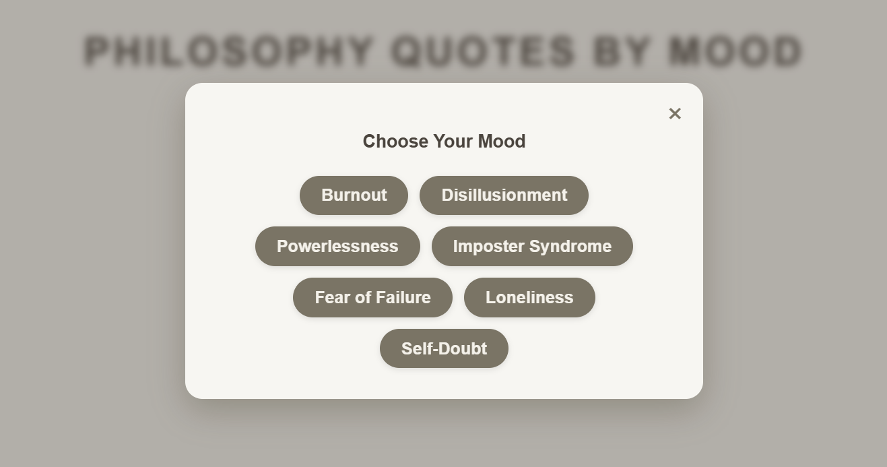
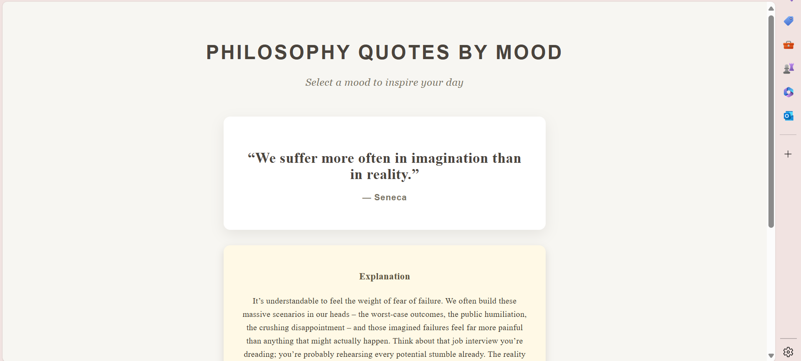
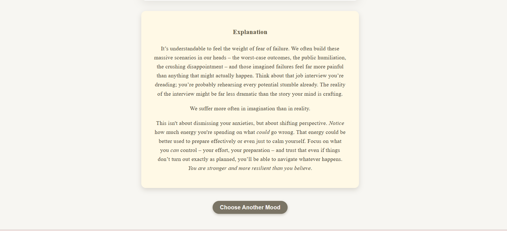

# Wisdome Threads

**Philosophy Quotes by Mood** — An interactive React app that serves philosophy quotes tailored to your current mood, along with insightful explanations.

---

## Demo

  
*Choose your mood to get inspired.*



  
*Philosophy quote and explanation based on your selected mood.*

---

## Features

- Select from a list of moods (e.g., Burnout, Self-Doubt, Fear of Failure).
- Fetches philosophy quotes related to the chosen mood.
- Shows detailed explanations that relate the quote to modern life.
- Accessible and keyboard-navigable modal for mood selection.
- Clean and responsive UI built with React.

---

## Tech Stack

- Frontend: React
- Backend: FastAPI (deployed separately)
- Communication: REST API between frontend and backend

---

## How to Run Locally

1. Clone the repo and checkout the branch:

   ```bash
   git clone <your-repo-url>
   cd quotes_app
   git checkout mood-first-flow
